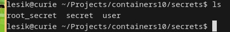
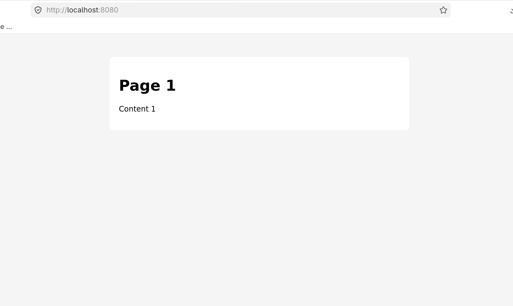
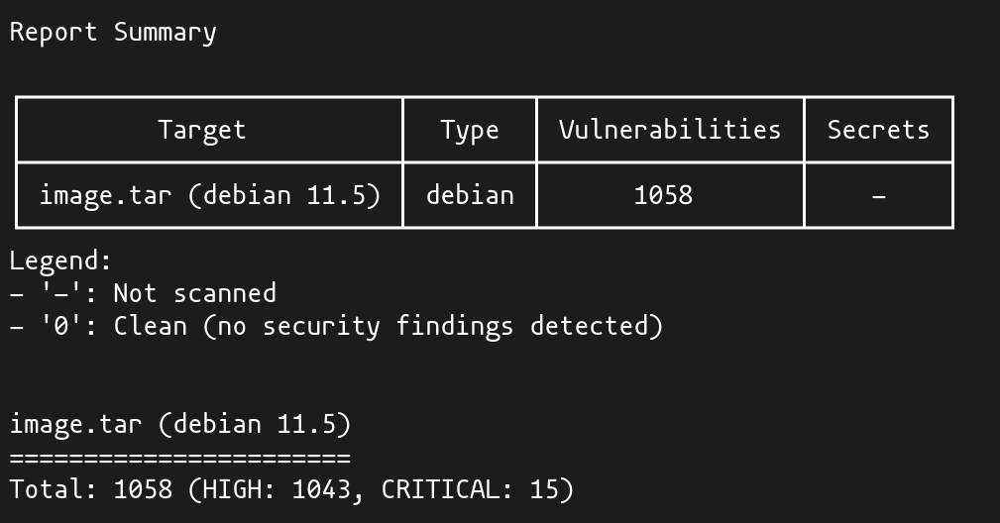

#+TITLE: Лабораторная работа: Управление секретами в контейнерах

Пустовой Алексей IA2404

* Цель работы
Изучить методы безопасного управления секретами в контейнерах.

* Задание
Создать многосервисное приложение с использованием Docker Compose и
секретов.

* Выполнение работы

** 1. Копирование проекта
Проект containers08 был скопирован в containers10.

** 2. Переход на MySQL
Приложение было переведено с SQLite на MySQL.

#+begin_src php
$dsn = "mysql:host={$config['db']['host']};dbname={$config['db']['database']}";
#+end_src

** 3. Настройка Dockerfile
Установлено расширение pdo_mysql.

#+begin_src dockerfile
docker-php-ext-install pdo_mysql
#+end_src

** 4. Настройка Docker Compose
Созданы сервисы frontend, backend и database.

** 5. Использование секретов
Созданы файлы секретов и подключены через Docker Secrets.

** 6. Работа приложения
Приложение успешно подключается к базе данных и отображает данные.

** 7. Проверка безопасности
Для получения сводной информации об уязвимостях контейнерного образа
использовался инструмент Trivy, поскольку в podman отсутствует
т.н. `scout`, а я отказываюсь пользоваться отвратительным
докером. Этот инструмент решает ту же задачу. Он позволяет получить
overview, включающий количество уязвимостей по уровням критичности.

* Ответы на вопросы

** Почему плохо передавать секреты в образ?
Потому что они сохраняются в слоях образа и могут быть извлечены.

** Как безопасно управлять секретами?
Использовать Docker Secrets или внешние хранилища.

** Как использовать Docker Secrets?
Создать secrets, подключить к сервисам и читать из /run/secrets.

* Выводы
В ходе работы было реализовано многосервисное приложение с безопасным хранением секретов.
